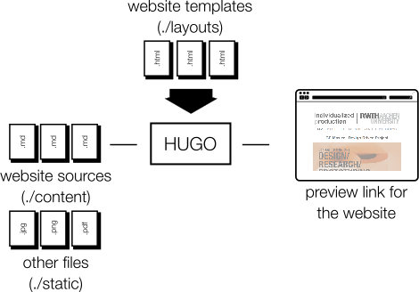

# An Example of a Website Development Process

Using a Static-Site-Generation tool named _HUGO_ and a repository made up of markdown files, images/videos and HTML templates.

Below is a diagram of what happens each time we change the repository:  



In any development team, you have to be on the same page with other developers in the team with regard to:
1. The _file-naming policy_: how to name the files we add to the repo in different directories
1. The _branch-naming policy_: how do we call our branches
1. The _merge-request documentation_:
  - when to mark the merge request as a draft, 
  - how to name the merge request,
  - what information to add to the merge-request body

In the session on the 1st of December, 2021 of the DSSIPD course, **we did not have clear policies.** This resulted in a lot of inconsistency which would make managing the development difficult, and hence would be unacceptable in a professional environment.

Hence, when joining a new development team, even if you are a consultant, a content creator, or a manager, it is important to ask how things are expected to be done to maximize the impact of your contributions and to minimize friction with coworkers and line managers.

## Contribution Guidelines to this Repo

In order to mitigate the problems above and to help you grow professionally, we came up with the following guidelines after the session on the 1st of December:

1. **Filenames:** all filenmes should be in small-caps, dashes in-between words, and no spaces/special characters. More specifically:
    1. Filenames in `./static/videos/` (for the competition entry videos) use either your first name or your last name, depending on which one is more unique (if both are equally unique, then it is up to you to decide). If more than one video needs to be pushed, use a dash and a number before the extension (e.g. `orwa-1.mp4`, `orwa-2.mp4`)
    1. Filenames in `./content/post` (for the competition entry articles) follow the format "`YYYY`-`MM`-`DD`-`first`-`last`.md" (please see the examples in that directory)
1. **Branch names:**
    1. For branches adding a new competition entry: use _"competition-`first`-`last`"_ to indicate that it is a branch designating a competition entry and that it belongs to you.
    1. For branches fixing an issue: use _"bugfix-issue-`number`"_ where `number` is the issue number.
1. **Merge request:** please mark the merge request as a draft until you are sure that it runs correctly (using the *preview_website* batch file ran locally) and that all the changes you have made locally are already pushed to your branch on the remote. The title for the merge request should be:
    1. "Competition entry for `first` `last`" in case of requesting a merge of a competition entry
    1. "Bugfix for issue #`number`" in case of requetsing a merge of a requested change (using the _issues_ feature in GitLab)

In the meantime, we do not require any information or documents to be attached to the body of the merge request.

## Adding a competition entry

After creating your own branch (following the guidelines above). Follow these steps:

1. Look for your video file in the `./static/video` folder on this repo, this has one of two possible outcomes:
    1. You found the video file(s), they have been pushed by the instructor from Moodle. Keep note of the filename stem (without the extension), and let's call that `video` and go to step 2 below.
    1. The file is not there, because you did not submit on time. In this case, you will have to commit your video file to `./content/video` (please follow the naming guidelines above). The stem of this filename (without the extension) is assume to be `video` in step 2 below.
2. After you identified the video, this is the time to add **a new `.md` file** in the `./content/post` directory of the repo (please follow the naming guidelines above). In this file, please use the contents of `2021-12-01-orwa-diraneyya.md` as a template while changing this line:
    ```
    
    ``` 
    to include the video filename stem `video` where the three dots `...` are (without the extension).
3. Use the `preview_website.bat` batch file to ensure that the two changes above result in adding your competition entry to the showdown website.
4. Commit the changes above to **your own created branch** and push the chages to the remote.
5. Go to [GitLab.com](https://gitlab.com/rwth-crmasters-wise2122/deep-music-visualizer-showdown) and create a merge request (please follow the merge-requet guidelines above).

## References

- [Deep Music Visualizer](https://github.com/msieg/deep-music-visualizer): Is a repository on GitHub that we use in this project to generate music visualizations from a music file and a list of image classes from a public dataset.
- [HUGO](https://gohugo.io/): Is a computer program that generates a website from a set of `.md` files containing the content, which are formatted using a number of `.html` _Go_ templates.
- [GitLabs CI/CD](https://docs.gitlab.com/ee/ci/yaml/): Is a DevOps system where pushes to GitLab repository triggers a computer script that can then generate something useful, in this case a website.
- [GitLab Pages](https://docs.gitlab.com/ee/user/project/pages/): Is the part of GitLab where GitLab CI/CD generates a website and GitLab provides a URL where this DevOps-generated website can be served.
